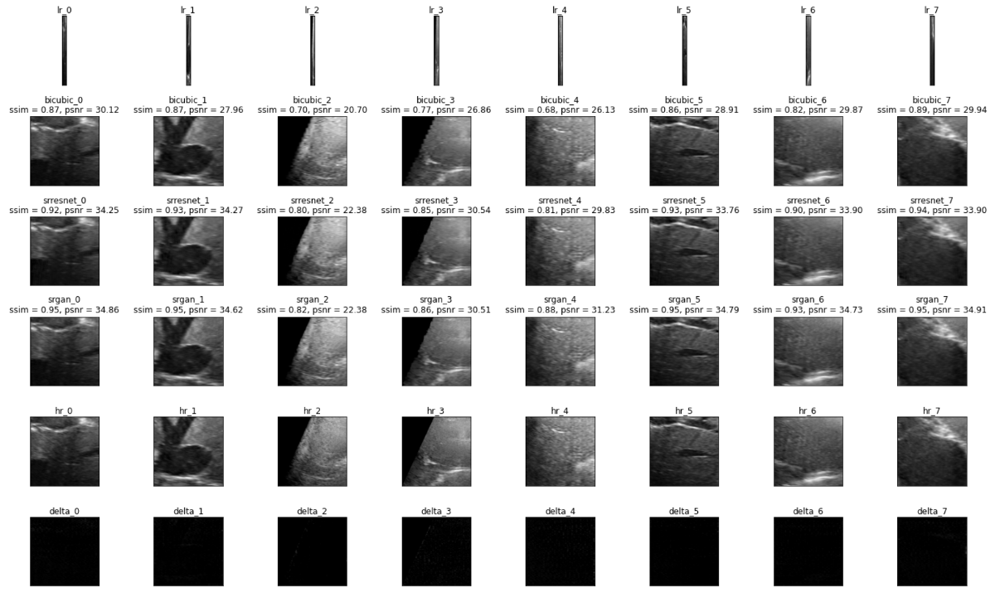

# Single Image Super Resolution on Medical Images (Ultrasound & CT)

[](https://opensource.org/licenses/Apache-2.0)

---


The above two figures shows example outcomes of this medical image adapted [SISR model](https://github.com/jason-zl190/sisr.git) model. Top is the result of ultrasound images and below is the result of CT scans. The result of CT scans was equalized by histogram to fairly compare the differences between different rows.

The Ultrasound dataset is a part of  [tensorflow datasets](https://github.com/tensorflow/datasets.git). And the data is provided by [Duke Ultrasound](https://www.tensorflow.org/datasets/catalog/duke_ultrasound). 

The CT dataset can be get from [this forked repo](https://github.com/jason-zl190/datasets.git) of [tensorflow datasets](https://github.com/tensorflow/datasets.git). And the data is provided by [NIH Deeplesion](https://nihcc.app.box.com/v/DeepLesion). 


## Quick Start

### Medical Image Degradation Models
<p align="center">
  
</p>

Super-resolution is a process of upscaling and improving the details within an image. This estimation is an inverse problem mapping from an LR observation to its HR representative. In this scenario, an LR observation usually comes from a specific degradation model. Unlike the degradation of an optical image, like a phone camera captured image, which simultaneously happens in two dimensions of spatial space. 
The choice of degradation model of medical images depends on the reconstruction methods. In the simplest case, Ultrasound images are constructed by vertical beam scan lines in spatial space. So the degradation of ultrasound images occurs in the only x-direction. On the contrary, the degradation of CT scans occurs in theta line of radon space, according to FBP(filtered back projection) reconstruction process. Therefore, the low-resolution observations of Ultrasound images & CT scans can be obtained by the above degradation models (left is the degradation model of Ultrasound images, right is the degradation model of CT scans.)

### Adapted Models
<p align="center">
  
</p>

The above figure shows three SISR model structures. From top to bottom, the top is the original model. the lasted two are adatped SISR models according to the degradation model of Ultrasound images and the degradation model of CT scans separately.

### Metrics
| Duke Ultrasound     | Bicubic           | SRResNet/SRGAN  | HR |
| :-------------:     |:-------------:    | :-----:         |:--:|
| PSNR                | 21.58             | 29.79/33.12     |  |
| SSIM                | 0.79              |   0.87/0.91     | 1  |

| NIH Deeplesion(CT)  | Bicubic           | SRResNet/SRGAN  | HR |
| :-------------:     |:-------------:    | :-----:         |:--:|
| PSNR                | 13.32             | 31.24           |  |
| SSIM                | 0.40              |   0.86          | 1  |


### Training the model from scratch
The repo was designed to be run in Google Cloud and makes use of GCS for logging. 
It contains three training tasks, which are `srresnet_task`, `discriminator_task` and `srgan_task`. 


`srresnet_task` trains the generator of the srgan solely, `discriminator_task` trains the discriminator of the srgan solely and `srgan_task` trains both the generator and the discriminator jointly.


To train the srresnet, the generator solely, using
```
python3 -m trainer.srgan_task --job-dir 'gs://<project>/<path to store tensorboard jobs>'
```

To train the discriminator solely, using
```
python3 -m trainer.discriminator_task --job-dir 'gs://<project>/<path to store tensorboard jobs>'
```

To train srgan, the generator and discriminator jointly, using
```
python3 -m trainer.srgan_task --job-dir 'gs://<project>/<path to store tensorboard jobs>'
```

To use pretrained weight, specify the weight paths by setting the parameters: `g_weight` and `d_weight`. E.g.
```
python3 -m trainer.srgan_task --g_weight '<pretrained generator weight path>' --d_weight 'pretrained discriminator weight path' --job-dir 'gs://<project>/<path to store tensorboard jobs>'
```

More custom training parameters can be set by reading the configuration file: `trainer/config.py`

### Switching between trainings
The default trainig are set for CT scans. To change the trainig for Ultrasound images, replace the following two lines
```
from trainer.datasets.sisr_ct import deeplesion_lr_hr_pair
from trainer.models.sisr_ct import [MySRResNet | Discriminator | MySRGAN]
```
with
```
from trainer.datasets.sisr_ultrasound import deeplesion_lr_hr_pair
from trainer.models.sisr_ultrasound import [MySRResNet | Discriminator | MySRGAN]
```
### Warning
The CT data is enormous and requires around 60GB disk space and 10 hours to download and serialized. The actual download time depends on Internet speed. Besides, the calculation of 2000 LR samples of CT scans may require another 10 hours. So, be patient and prepare some tea and cookies for the first time training.

## License
Copyright 2019 Zisheng Liang

Licensed under the Apache License, Version 2.0 (the "License"); you may not use this file except in compliance with the License. You may obtain a copy of the License at

http://www.apache.org/licenses/LICENSE-2.0

Unless required by applicable law or agreed to in writing, software distributed under the License is distributed on an "AS IS" BASIS, WITHOUT WARRANTIES OR CONDITIONS OF ANY KIND, either express or implied. See the License for the specific language governing permissions and limitations under the License.

## Thanks
Thanks to Ouwen and Prof.Palmeri's Lab providing the ultrasound data and thanks to Duke DS+ program providing compute resources for the CT adapted model training.

## Reference
- O. Huang et al., "MimickNet, Mimicking Clinical Image Post-Processing Under Black-Box Constraints," in IEEE Transactions on Medical Imaging.

- Ke Yan et al., "DeepLesion: automated mining of large-scale lesion annotations and universal lesion detection with deep learning," J. Med. Imag. 5(3) 036501 (20 July 2018)

- C. Ledig et al., "Photo-Realistic Single Image Super-Resolution Using a Generative Adversarial Network," 2017 IEEE Conference on Computer Vision and Pattern Recognition (CVPR), Honolulu, HI, 2017, pp. 105-114.
